  

   

  

   

  

    
     
    <b>"I believe Darkness was not created, it was there before our creation."</b>
     
    
  

### The Logistic Prophecy
I hold a **Bachelor's degree in Metropolitan Cybertraffic Operation and Algorithms Logistic Sciences**. 
In the intersection of Heaven (Seamless UI) and Hell (Complex Backend Logic), I exist. I orchestrate the flow of digital souls through algorithms that bridge the gap between human desire and machine efficiency.

### The Dual Arsenal (Heavenly Design & Hellish Logic)

  

### The Grand Records (Analytics)

  
  
  

 

  

 

  

### Ascension

  
   
  My last year, rebuilt as a city over the abyss. Every tower is a week and every window a day, lit gold by the work shipped. The Punished God crosses it roof by roof, gathers each contribution as a soul, cuts down the demons waiting in the empty weeks, and faces The Darkness at Heaven's Gate. Rebuilt twice a day from my live contribution graph.

### Digital Presence
**Name:** festomanolo  
**Occupation:** Full Stack Developer, AI & Deep Learning Specialist, UI/UX Architect  
**Education:** B.Sc Metropolitan Cybertraffic & Algorithmic Logistics  
**Location:** [festomanolo.com](https://festomanolo.com)
